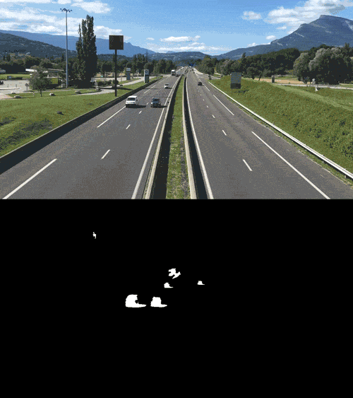
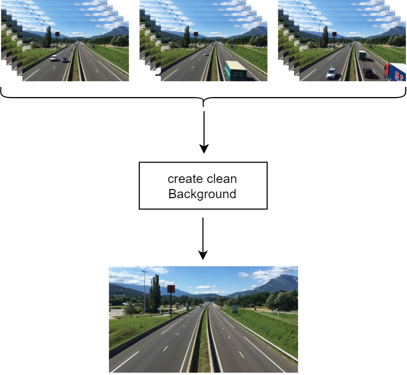
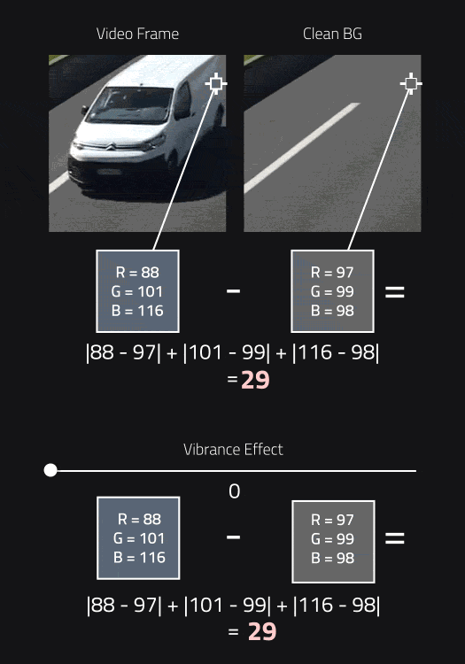
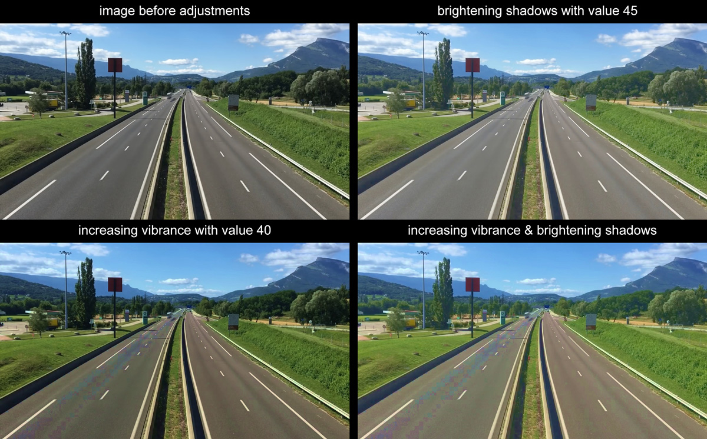
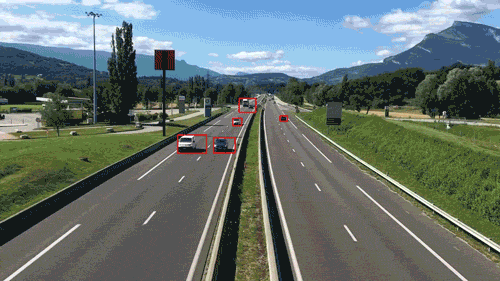
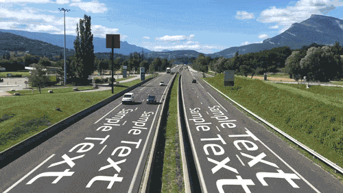

# Moving Objects Segmentation



On this project I tried to perform moving objects segmentation using background subtraction technique.
The introduced method relies on two important functions:

* Create clean background
* Generate mask sequence

## Create clean background



The main idea is taking several frames from the video sequence and estimating the covered regions by any distracting elements that come in front of the clean background, this method only works if the frames are aligned and the camera is not moving otherwise the method is not going to work.

```python
createCleanBG(input_path, memorize, skipping, save_result, output_path)
```

```input_path``` (string): path of input video sequence.

```memorize``` (int): number of frames that are used to generate a clean background, usually around 10 to 15 frames works fine.

```skipping``` (int): number of frames to skip before caching another frame to generate the clean background, if the motion on the video is too slow consider increasing this number.

```save_result``` (boolean): boolean parameter to decide whether to save the generated result or not.

```output_path``` (string): output path of the generated clean background.

## Generate mask sequence

Mask sequence is generated by subtracting each video frame from the clean background. There are some image adjustments are used to generate better masking results:

* ### Vibrance

    Vibrance adjustment increases the saturation of the low saturated colors in the image and leaves the saturated colors as it is, this adjustment is inspired by Adobe Photoshop filter, although the implementation is different because the desired target is not generating plausible colors by human eyes but shifting the colors in the low saturated pixels to create a contrast in saturation between pixels with different Hues so after subtraction any slight difference in the colors (Hue values) would become more clearer after increasing the vibrance.

    

* ### Brightening Shadows

    This adjustment only affects the dark pixels of the image and increases its luminance, applying this adjustment would also create a wider range of values after the subtraction and it would become clearer to threshold and distinguish the difference in color values after brightening the dark pixels.

    

    The figure below shows that applying image adjustments before segmentation would generate better segmentation results.

    

## Applications

The generated masks could be used for many different purposes, for example it could be used to localize moving objects on a video footage.



The generated masks could be used also on VFX production as luma matte to mask objects from the background.


